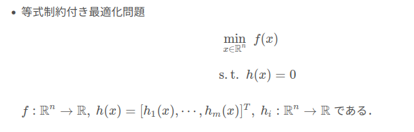
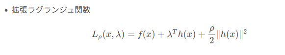
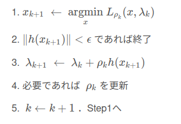
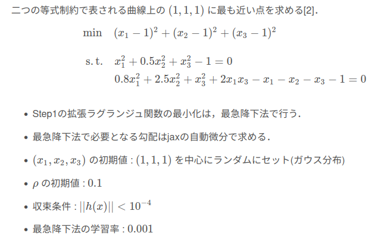

# 乗数法
乗数法（拡張ラグランジュ関数法）のPython実装．

<br>

# 問題設定

<br>




# アルゴリズム


# 例題 

<br>

# 環境構築
```
pip3 install numpy matplotlib jax
```
<br>

# 実行方法
```
python3 example.py
```
<br>

# 実行結果

```
initial point = [ 0.7701838  1.4904741 -0.5514398]
--------
iteration:    0  |  objective: 1.504  |  h_norm: 0.4029  | rho: 0.1
--------
iteration:    1  |  objective: 1.225  |  h_norm: 1.0567  | rho: 0.2
--------
iteration:    2  |  objective: 1.085  |  h_norm: 1.1801  | rho: 0.4
--------
iteration:    3  |  objective: 0.903  |  h_norm: 1.0766  | rho: 0.8
--------
iteration:    4  |  objective: 0.593  |  h_norm: 0.6171  | rho: 1.6
--------
iteration:    5  |  objective: 0.355  |  h_norm: 0.0901  | rho: 1.6
--------
iteration:    6  |  objective: 0.350  |  h_norm: 0.0880  | rho: 3.2
--------
iteration:    7  |  objective: 0.374  |  h_norm: 0.0328  | rho: 6.4
--------
iteration:    8  |  objective: 0.388  |  h_norm: 0.0115  | rho: 12.8
--------
iteration:    9  |  objective: 0.398  |  h_norm: 0.0020  | rho: 12.8
--------
iteration:   10  |  objective: 0.399  |  h_norm: 0.0036  | rho: 25.6
--------
iteration:   11  |  objective: 0.396  |  h_norm: 0.0008  | rho: 25.6
--------
iteration:   12  |  objective: 0.395  |  h_norm: 0.0001  | rho: 25.6
mulitiplier method is converged.

optimal point = [0.57314324 0.83327645 0.5695581 ], optimal value = 0.39528369903564453

elapsed time = 2.76 sec.
```

<br>

# 参考文献
1. 今野浩, 山下浩: 非線形計画法, 日科技連

2. Stephen Boyd and Lieven Vandenberghe: Introduction to Applied Linear Algebra – Vectors, Matrices, and Least Squares 